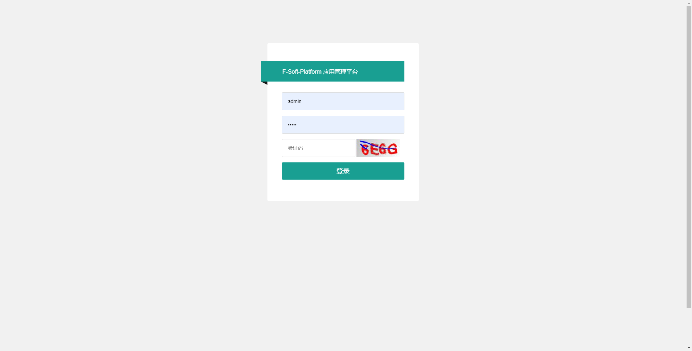
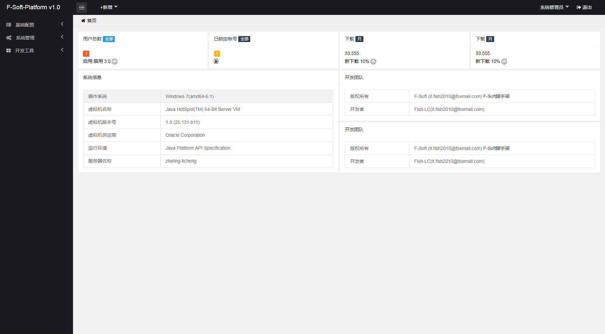
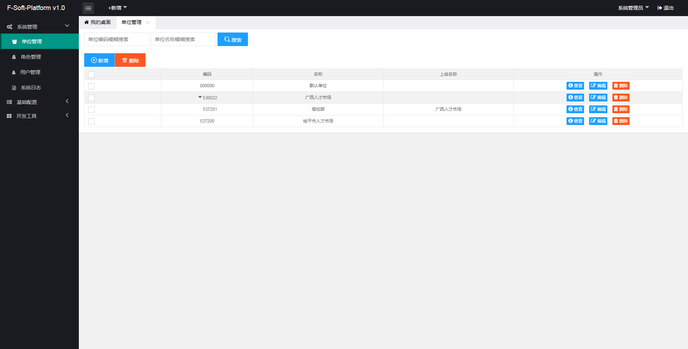
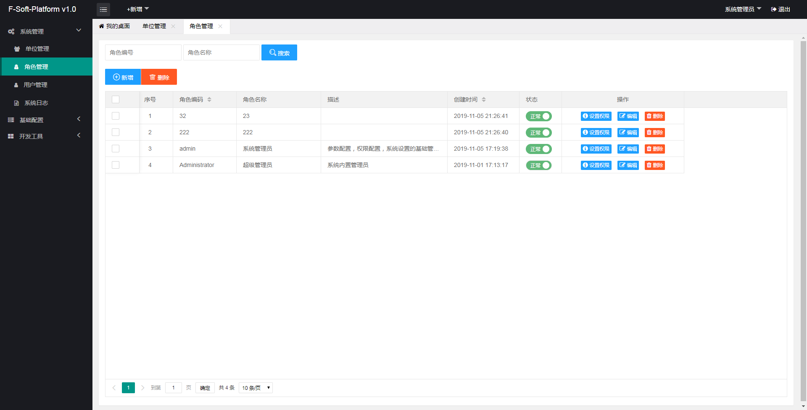
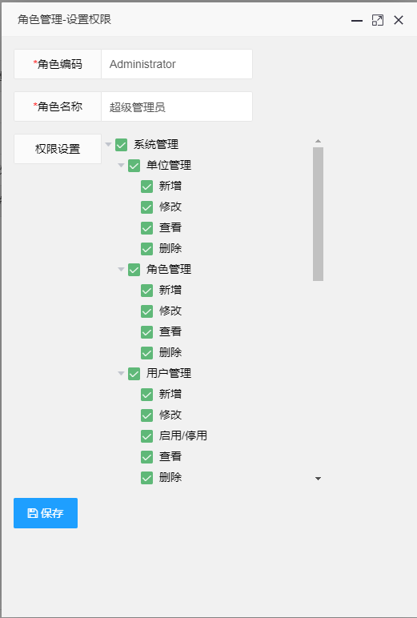
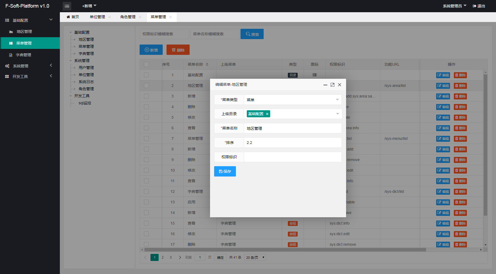
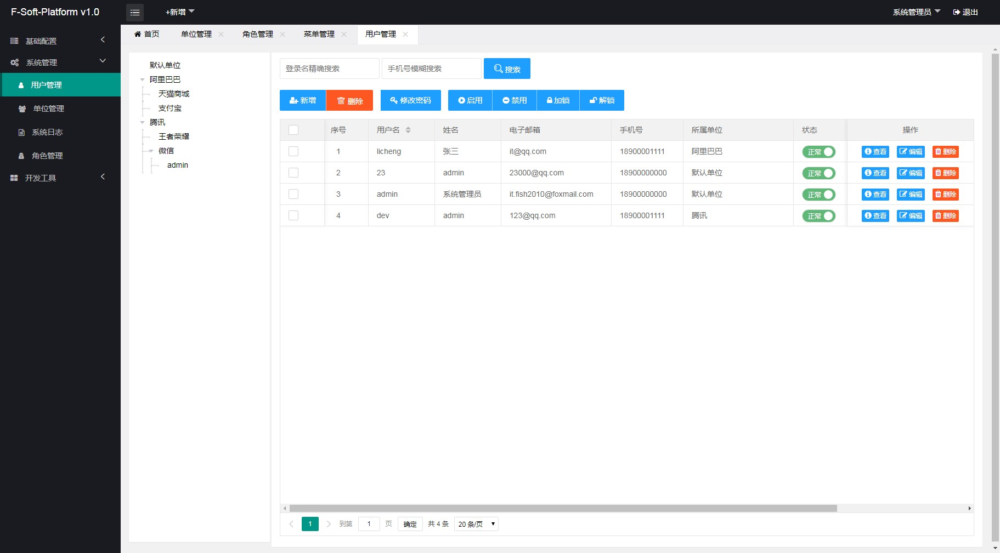
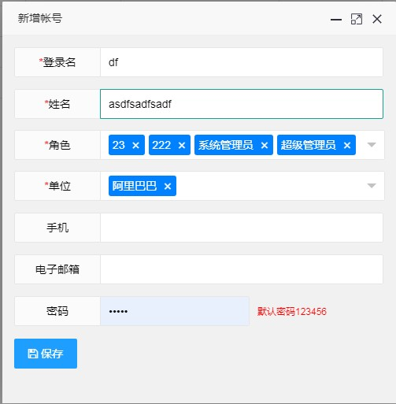
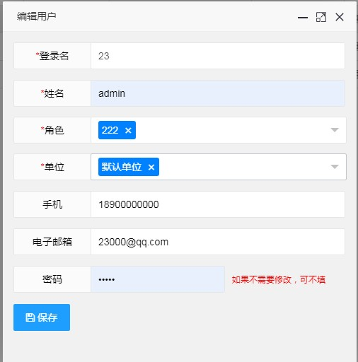
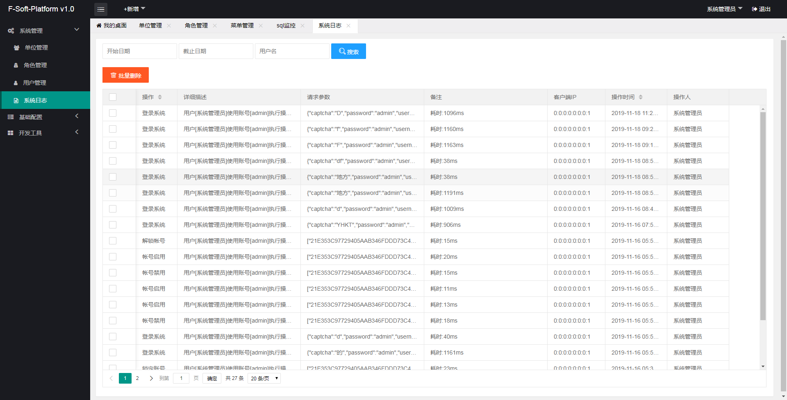

# F-Soft 项目介绍
F-Soft泛松后台管理平台，旨在搭建一个接私活的基础框架，方便人员开发自己的业务系统。框架用到了比较老的技术，没有什么云、微架构，热插拔部署、区块链等等……  
# **更新说明** 
## *2020-02-14 更新*
	1. 调整DB变更，提取共享字段
	2. 实现单位管理功能
	3. 优化菜单管理，实现“上级目录”的选择
	4. 优化用户管理，实现“单位”“角色”的下拉选择
	5. 依赖于DB属性变更的部分优化    

# **框架说明** 
## 后端：`Spring+SpringMVC+MyBatis+Shiro+Redis缓存`  
### Spring
轻量级的控制反转(IoC)和面向切面(AOP)的容器框架。  
  
	1. 控制反转——Spring通过一种称作控制反转（IoC）的技术促进了松耦合
	2. 面向切面——Spring提供了面向切面编程的丰富支持，允许通过分离应用的业务逻辑与系统级服务（例如审计（auditing）和事务（transaction）管理）进行内聚性的开发  

### SpringMVC
使用IoC对控制逻辑和业务对象提供了完全的分离，允许声明性地将请求参数绑定到你的业务对象中。  
### MyBatis 
优秀的持久层框架，它支持定制化 SQL、存储过程以及高级映射。    

	1. MyBatis 避免了几乎所有的 JDBC 代码和手动设置参数以及获取结果集。
	2. MyBatis 可以使用简单的 XML 或注解来配置和映射原生类型、接口和 Java 的 POJO（Plain Old Java Objects，普通老式 Java 对象）为数据库中的记录。  
### Apache Shiro
强大且易用的Java安全框架,执行身份验证、授权、密码和会话管理。使用Shiro的易于理解的API,您可以快速、轻松地获得任何应用程序,从最小的移动应用程序到最大的网络和企业应用程序。   
### Redis（全称：Remote Dictionary Server 远程字典服务）
是一个开源的使用ANSI C语言编写、支持网络、可基于内存亦可持久化的日志型、Key-Value数据库，并提供多种语言的API

## 前端：`Layui+JQuery+Freemarker`
由于本人前端技术水平有限，所以直接使用了开源项目X-admin，唯一要做的事情，仅仅是把html语法转为freemarker语法。  
### **X-admin** [X-admin 经典前端网站后台管理框架](http://x.xuebingsi.com/)
### **Layui** [Layui-经典模块化前端框架](https://www.layui.com/)
### **JQuery** [JQuery](https://jquery.com/)
	jQuery的核心特性可以总结为：具有独特的链式语法和短小清晰的多功能接口；具有高效灵活的css选择器，并且可对CSS选择器进行扩展；拥有便捷的插件扩展机制和丰富的插件。  
	jQuery兼容各种主流浏览器，如IE 6.0+、FF 1.5+、Safari 2.0+、Opera 9.0+等。  
#### ** FreeMarker ** [FreeMarker-百度百科](https://baike.baidu.com/item/freemarker/9489366?fr=aladdin)
	FreeMarker是一款模板引擎： 即一种基于模板和要改变的数据， 并用来生成输出文本（HTML网页、电子邮件、配置文件、源代码等）的通用工具。 它不是面向最终用户的，而是一个Java类库，是一款程序员可以嵌入他们所开发产品的组件。  
	FreeMarker是一个用`Java语言编写的模板引擎` ，它基于模板来生成文本输出。FreeMarker与Web容器无关，即在Web运行时，它并不知道Servlet或HTTP。   
# **部署配置**
## 数据库初始化
	执行项目中/doc/F-Soft-fish-dbinstall.sql 文件
## db.properties配置
只需要修改`jdbc.url`,`jdbc.username`,`jdbc.password`，其他值保持默认。
 
	jdbc.url=jdbc:mysql://localhost:3306/mysql?allowMultiQueries=true&useUnicode=true&characterEncoding=UTF-8
	jdbc.username=root
	jdbc.password=root
	jdbc.initialSize=5
	jdbc.maxActive=30
	jdbc.minPoolSize=2
	jdbc.maxIdleTime=30000
	jdbc.idleConnectionTestPeriod=100

* `jdbc.url` 配置数据库连接，暂时仅限于支持mysql数据库
* `jdbc.username` 数据库用户，明文，`（出于安全考虑，建议生产环境使用Spring配置，自行编写解密规则）`
* `jdbc.password` 数据库用户登录密码，明文；`（出于安全考虑，建议生产环境使用Spring配置，自行编写解密规则）`  

# **功能效果截图**
#### **登录页面**
  
#### **首页**
  
#### **单位管理**

#### **角色管理**

#### **角色管理（设置权限）**

#### **菜单管理**

#### **用户管理**

###### 用户编辑（新增）

#### **系统日志** 

